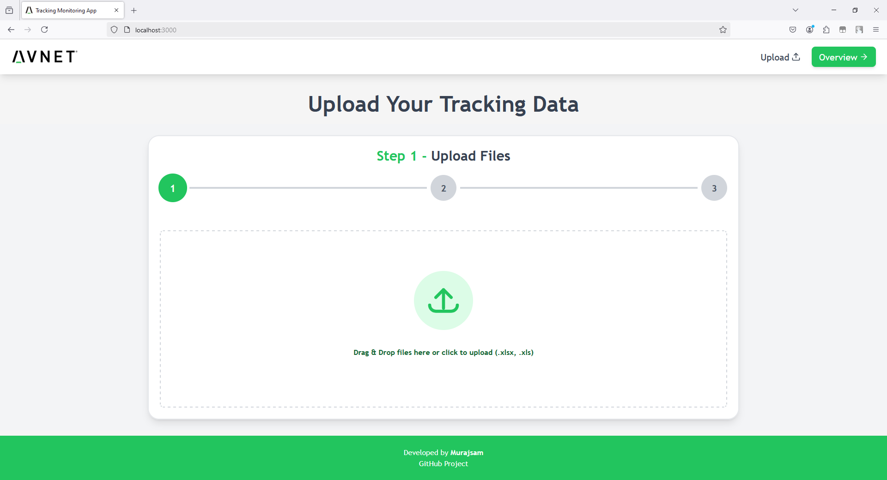
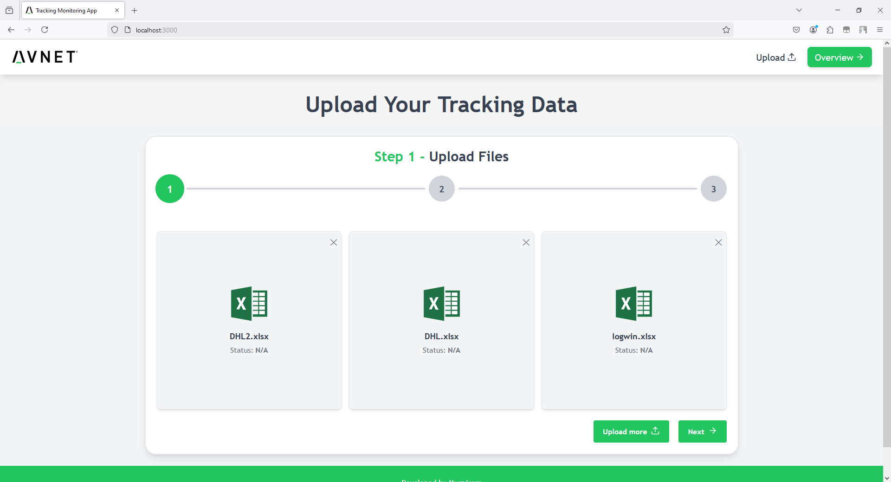
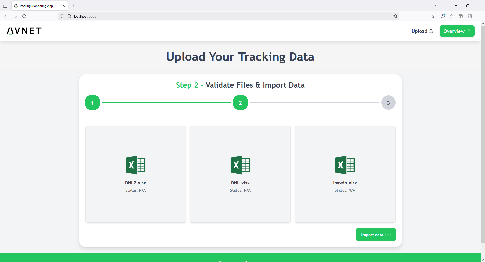
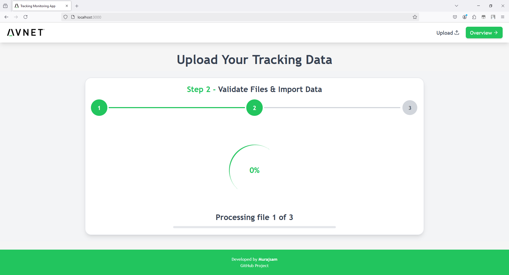
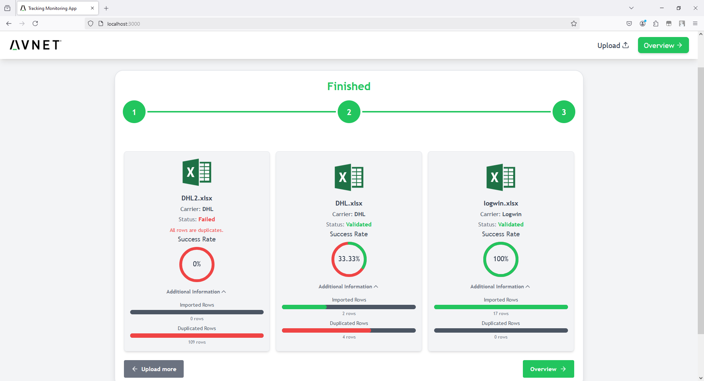
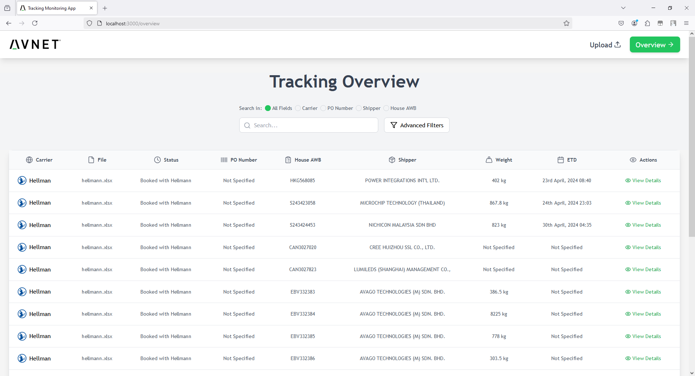
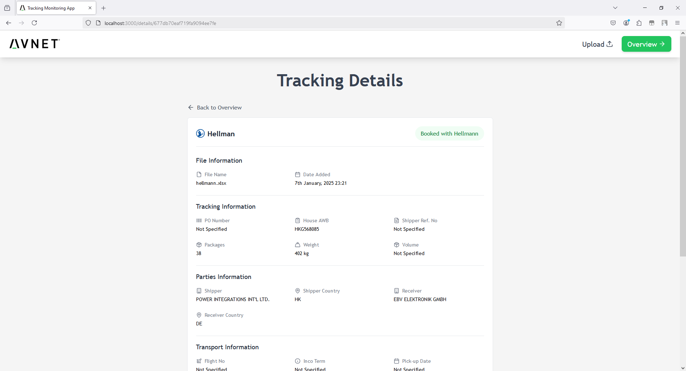

# Tracking Monitoring App

This is a web application that allows users to upload tracking data from excel files (examples can be found in `excel examples` folder) and view it in a user-friendly interface. The application is built using MERN stack (MongoDB, Express.js, React.js, and Node.js) and uses the `xlsx` and `node-xlsx` libraries to read from Excel files. Database stores tracking data from 3 different carriers: DHL, Hellman, and Logwin. Tracking data is stored in predefined format by performing specific mapping rules for each carrier. Mapping rules can be found in `mapping.csv` file.

## Features

- Upload tracking data from Excel files (.xlsx, .xls)
- Validate tracking data and import it into MongoDB Atlas cloud database (DHL, Hellman, Logwin)
- Upload history of Excel files in MongoDB Atlas cloud database
- Error handling for failed validation
- View tracking data in a user-friendly interface
- Filter tracking data based on carrier, status, shipper, weight, date range, and search (filters are dynamic and change as more filters are selected based on the data)
- Display detailed information for each tracking
- Mobile view support (responsive design)

## Mapping Rules Solution

To map tracking data for carriers (`DHL`, `Hellman`, `Logwin`) based on predefined rules from `mapping.csv` file, step-by-step approach was used:

1. **Carrier Definitions**:

   - An array of carriers is defined, where each carrier (`DHL`, `Hellman`, `Logwin`) has a name and an array of specific field names. These field names represent the expected structure of data in the Excel files.

2. **Converting Excel Files to JSON**:

   - The `xlsx` library is used to read the uploaded Excel file. Each sheet in the file is processed, converting the data into a JSON object.
   - This JSON object represents the rows of the Excel file as an array of objects, where each object value corresponds to a row value, and the keys represent the column headers of the Excel file.

3. **Carrier Matching**:

   - The application iterates through the JSON objects (rows) from excel file to determine if the data matches one of the carriers.
   - A match is identified when all field names from the carrier definition align with the key or value pairs in the JSON objects.
   - Each sheet in the Excel file is checked, and the process stops when the first matching carrier is found.

4. **Field Mapping**:

   - Once a matching carrier is identified, a new array of objects is created. Each object contains key-value pairs where:
     - **Key**: Field name from the carrier definition.
     - **Value**: The corresponding value from the Excel file for that field.
   - Special handling is applied for date fields and other data transformations, ensuring the data is correctly formatted.

5. **Applying Mapping Rules**:

   - Then array is processed again using predefined mapping rules from the `mapping.csv` file.
   - A `switch` statement is used to handle mapping rules and specific transformations for each carrier. For example:
     - Adjustments for date formats and time zones.
     - Weight conversions or other carrier-specific field mappings.

6. **Final Output**:
   - The final mapped data is returned along with the identified carrier’s name. This data is then passed to the backend for storage in the database.

## Pages

The application has three main pages:

1. **Upload Page / Home Page**:
   This page allows users to upload Excel files containing tracking data. There are three steps in the upload process: File Upload, Validation, and Import. The user can see the progress of each step. On the first step, the user can select multiple files at once or drag and drop files into the page and can also delete or add more files. On the second step, the user can no longer add or delete files. Lastly, on the third step, the files are being validated and tracking data is being imported into the database. Once the import is complete, the user can see the results of the imported files (each file shows the indentified carrier, number of imported rows, duplicated rows, and success rate).

2. **Overview Page**:
   This page displays a table of all imported tracking data from files. The user can filter the data based on carrier, status, shipper, weight, date range, and search. The table also provides links to the Detail Page for each tracking.

3. **Detail Page**:
   This page displays detailed information for a selected tracking. The user can see the file name, carrier, status, and additional information. The user can also see the tracking data in a table format.

## Backend API

The backend API is a Node.js application that handles the file upload and import. It uses the `xlsx` and `node-xlsx` libraries to read Excel files.

The API exposes three endpoints:

- `POST /api/files/upload`: This endpoint is used to upload Excel file and store it and it's tracking data in the database.

- `GET /api/trackings/:id`: This endpoint is used to retrieve tracking data for a specific tracking. It accepts a parameter `:id` representing the tracking ID. The API returns the tracking data in JSON format.

- `GET /api/trackings/all`: This endpoint is used to retrieve all tracking data. It returns a JSON array of tracking data.

## How to Run the Application

To deploy the application, you need to have Node.js and npm installed on your system. Once you have them installed, follow these steps:

1. Clone the repository to your local machine.

2. Navigate to the `backend` directory and install the dependencies by running `npm install`.

3. Navigate to the `frontend` directory and install the dependencies by running `npm install`.

4. Start the backend API by running `npm run dev` in the `backend` directory.

5. Start the frontend application by running `npm start` in the `frontend` directory.

## Screenshots

## Contributing

Contributions are welcome! If you find any bugs or have suggestions for improvements, please open an issue or submit a pull request on the GitHub repository.
